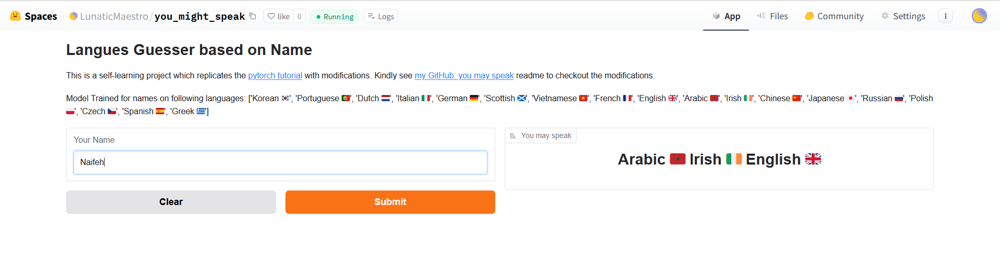
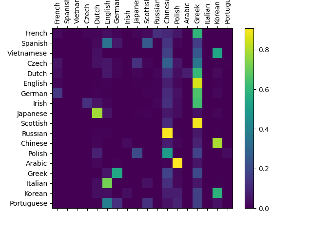
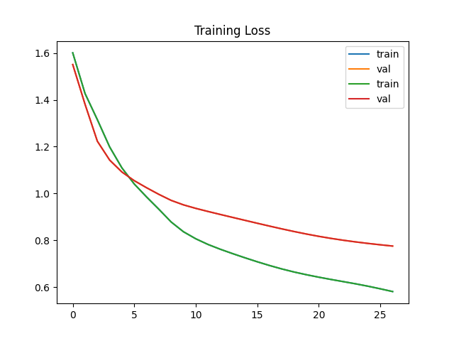
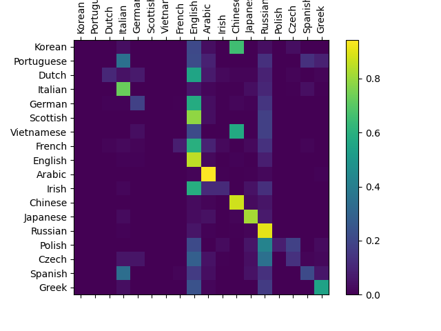
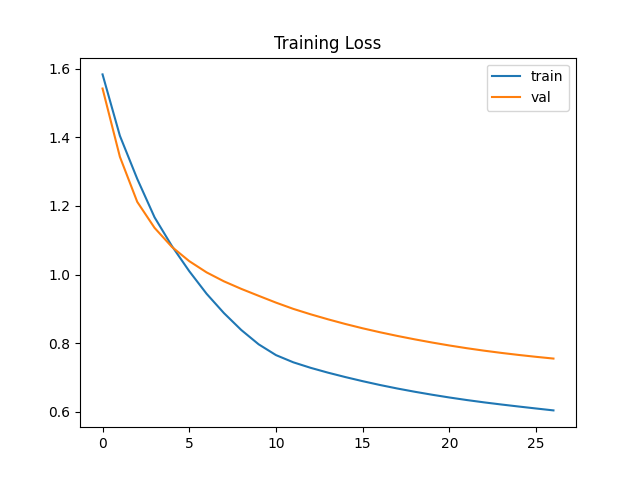

# Language Guesser based on Name

## Data Source

https://pytorch.org/tutorials/intermediate/char_rnn_classification_tutorial.html
Last Accessed: 30th Dec 2024

## Code Information

The code is partially inspired by https://pytorch.org/tutorials/intermediate/char_rnn_classification_tutorial.html

**Changes I Introduced**
- NamesDataset is separated from transformation, useful for transformation during inference
- target is made integer instead of one-hot encoding;
- changed the loss from combination of LogSoftmax + NLLoss to CrossEntropy (EXACTLY THE SAME STUFF); which further required removing the softmax layer from the architecture.
- DataLoader is added 
- Input made batch first > Corresponding RNN is also made batch first.

## Evaluation
Although the code is mostly replicated. However, I changed the dataloader to use apply lowercase transformation to data, and it confused the model.

> Notice that the *diagonal* brightness for the **without lowercase**, which can be said that the actual class being *arabic* (for example) is guess as *arabic*. This is not the case with **with lowercase**.

- Confusion matrix with **with lowercase** transformation
    
    

- Confusion matrix **without lowercase** transformation
    
    
